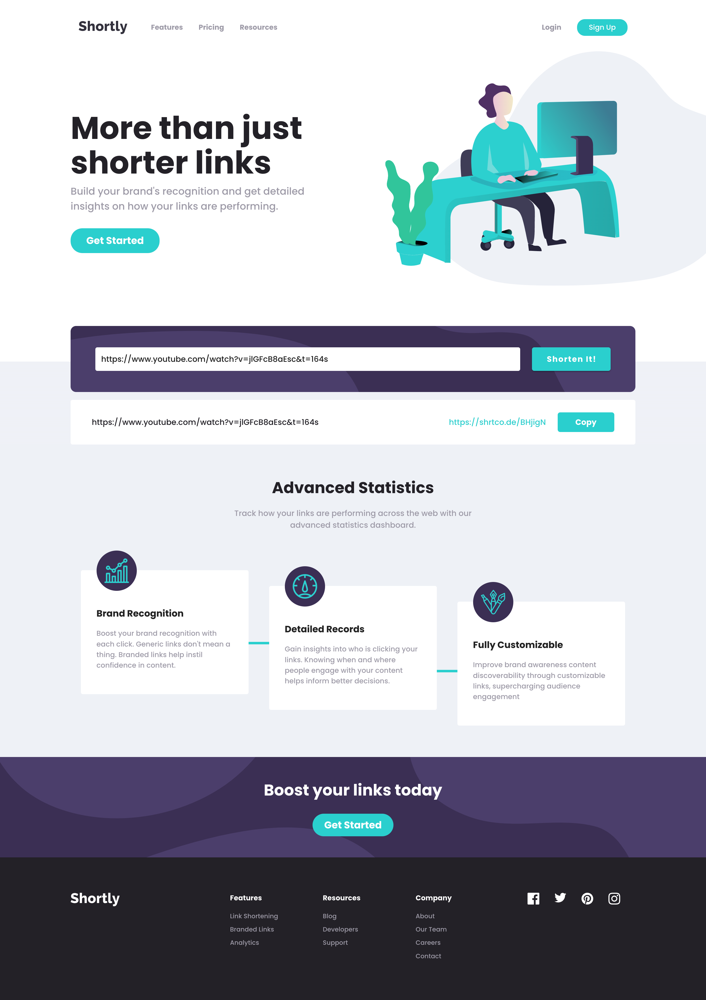
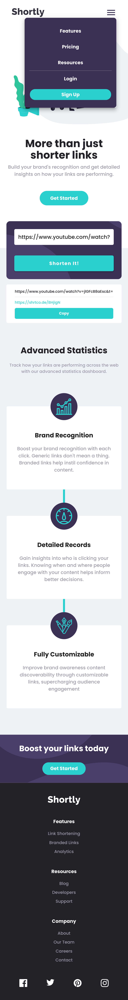

# Shortly - URL shortening

This is a solution to the [Shortly URL shortening API Challenge challenge on Frontend Mentor](https://www.frontendmentor.io/challenges/url-shortening-api-landing-page-2ce3ob-G). Frontend Mentor challenges help you improve your coding skills by building realistic projects. 

## Table of contents

- [Shortly - URL shortening](#shortly---url-shortening)
  - [Table of contents](#table-of-contents)
  - [Overview](#overview)
    - [The challenge](#the-challenge)
    - [Screenshot](#screenshot)
    - [Links](#links)
  - [My process](#my-process)
    - [Built with](#built-with)
    - [What I learned](#what-i-learned)
    - [Continued development](#continued-development)
  - [Author](#author)

## Overview

### The challenge

Users should be able to:

- View the optimal layout for the site depending on their device's screen size
- Shorten any valid URL
- See a list of their shortened links, even after refreshing the browser
- Copy the shortened link to their clipboard in a single click
- Receive an error message when the `form` is submitted if:
  - The `input` field is empty

### Screenshot




### Links

- Solution URL: [Add solution URL here](https://your-solution-url.com)
- Live Site URL: [Add live site URL here](https://your-live-site-url.com)

## My process

### Built with

- Semantic HTML5 markup
- CSS custom properties
- Flexbox
- CSS Grid
- Mobile-first workflow
- [VueJS](https://vuejs.org/) - JS library
- [Nuxt.js](https://nuxtjs.org/) - VueJS framework
- [Vuetify](https://vuetifyjs.com/) - Material Design Framework

### What I learned

I learned i lot about clamp, gradient, responsive width/font-size, layout positions, form validation and api consuming.

code i'm proud of:
```css
.card-wrapper:nth-child(2n)::before {
  position: absolute;
  top: 40%;
  left: -2.6rem;
  z-index: 999;
  display: block;
  content: "";
  border-bottom: 5px solid var(--Cyan);
  width: 2.6rem;
}

.card-wrapper:nth-child(2n)::after {
  position: absolute;
  top: 60%;
  right: -2.6rem;
  z-index: 999;
  display: block;
  content: "";
  border-bottom: 5px solid var(--Cyan);
  width: 2.6rem;
}
```
```js
goTo() {
  const element = document.getElementById("second-section");
  const y = element?.getBoundingClientRect().top + window.pageYOffset - 60;
  window.scrollTo({ top: y, behavior: "smooth" });
},
```

### Continued development

I will continue this project and implement another pages, practising the layout pattern and design.

## Author

- Website - [Henrique Melo](https://www.melohenrique.com)
